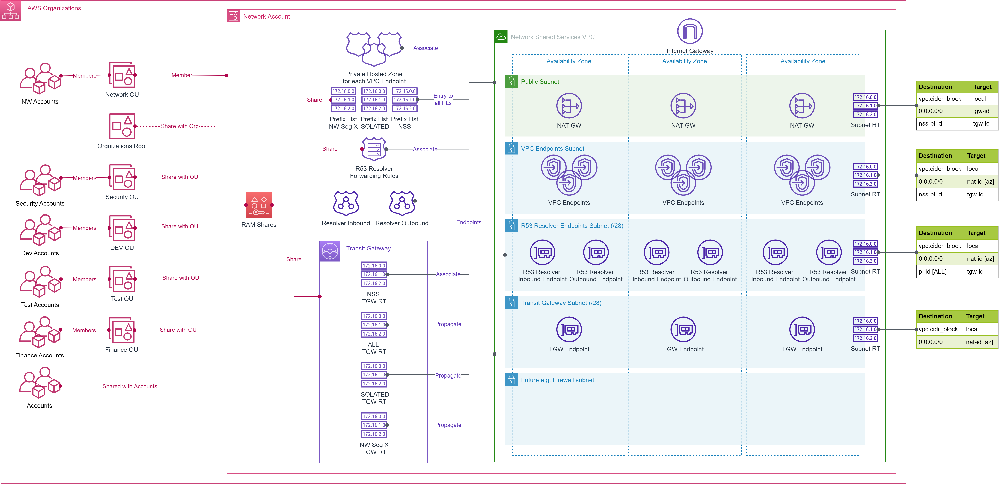
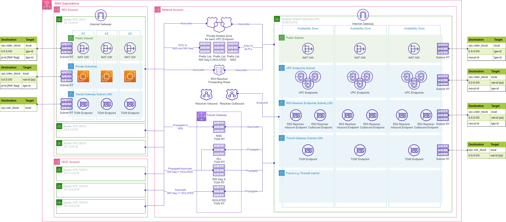
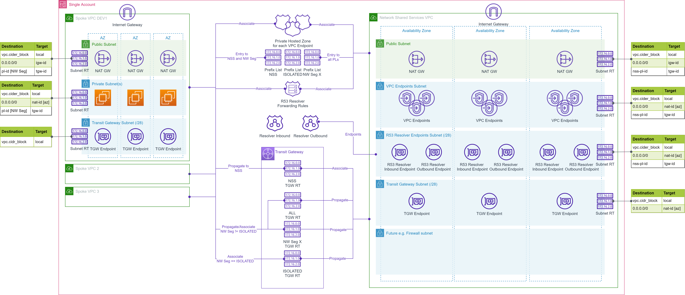

# Build Multi-Account and Multi-VPC AWS network infrastructure with Network Shared Services (NSS)

This solution is a set of Terraform modules to build [Multi-Account and Multi-VPC AWS network infrastructure](https://docs.aws.amazon.com/whitepapers/latest/building-scalable-secure-multi-vpc-network-infrastructure/welcome.html). Using these modules you can:
- Provision Network Shared Services (NSS) VPC in the *Network* account with
    - Network Segments for VPC to VPC connectivity.
    - Organization, Organization Units (OUs), or Accounts level sharing of NSS resources.
- Provision zero or more of the following supported NSS
    - [Centralized VPC private endpoints](https://docs.aws.amazon.com/whitepapers/latest/building-scalable-secure-multi-vpc-network-infrastructure/centralized-access-to-vpc-private-endpoints.html) for one or more [supported AWS services](https://github.com/aws-samples/aws-tf-nw-shared-svc/tree/main/modules/aws/vpc_endpoints/service_codes.md).
    - [Centralized hybrid DNS](https://docs.aws.amazon.com/whitepapers/latest/building-scalable-secure-multi-vpc-network-infrastructure/dns.html#hybrid-dns).

- Provision spoke VPCs in AWS account, with which sharing is enabled, along with
    - Network segment based VPC to VPC connectivity.
    - Connectivity to zero or more provisioned NSS.

As a side-effect, these modules support provisioning the complete solution in a single AWS account as well.

## Features

The solution has following features:

- Create Network Shared Services (NSS) VPC in the target (*Network or single*) AWS Account.
- Enable sharing and connectivity at Organization, Organization Units (OUs), or Accounts level for the provisioned NSS resources.
    - If shared at the Organization level then all accounts in the Organization can use NSS.
    - If shared with a list of OUs then all accounts in those OUs can use NSS.
    - If shared with a list of accounts then only those accounts can use NSS.
- Create zero or more of the following supported NSS.
    - Centralized VPC private endpoints for one or more [supported AWS services](https://github.com/aws-samples/aws-tf-nw-shared-svc/tree/main/modules/aws/vpc_endpoints/service_codes.md).
    - Centralized hybrid DNS.
- Create spoke VPCs in an AWS account, with which sharing is enabled, along with
    - Network segment based VPC to VPC connectivity across the accounts.
    - Connectivity to zero or more provisioned NSS.
- For the NSS VPC
    - Create zero or more network segments for VPC to VPC connectivity.
        - By default two network segments "ALL" and "ISOLATED" are always created.
    - For the single account setup, disable sharing but continue to support connectivity.
    - Define CIDRs for the VPC and subnets or let the module calculate the CIDRs.
    - Use [Prefix-list](https://docs.aws.amazon.com/vpc/latest/userguide/managed-prefix-lists.html) or super net CIDR blocks for subnet routing.
    - For NSS egress, create NAT GW in single AZ or all AZs.
- For the centralized VPC private endpoints NSS
    - Optionally enable VPC flow logs at subnet or individual AWS service level.
        - Log to Amazon CloudWatch or Amazon S3
        - Optionally encrypt the logs using a provided or generated KMS key.
        - Use a provided IAM role or create an IAM role for the Amazon CloudWatch or Amazon S3 logging.
        - Filter, aggregate, format, and partition logs based on the destination.
- For the centralized hybrid DNS NSS
    - Optionally create Route 53 resolver inbound endpoints for the provided on-premises CIDRs.
    - Optionally create Route 53 resolver outbound endpoints and Route 53 resolver forwarding rules for the provided on-premises domain names and DNS resolver IP addresses.
- For the spoke VPC
    - If no network segment is requested then connect to the "ISOLATED" network segment.
    - if the requested network segment is not supported then connect to the "ISOLATED" network segment.
    - "ISOLATED" network segment provides connectivity to NSS VPC only.
    - Enable connectivity to zero, all, or selected VPC private endpoints.
- Uniformly name and tag the provisioned resources.

## Prerequisites
- The target AWS Account(s) (e.g. Tooling, Network, and spoke VPC accounts) and AWS Region are identified.
- The AWS User/Role executing the Terraform scripts must have permissions to provision the bootstrap resources in the `tooling` account and `Terraformer` IAM role in other accounts.
- For the Multi-Account environment, the master account for the AWS Organization must have enabled sharing in the [AWS Resource Access Manager (RAM)](https://docs.aws.amazon.com/ram/latest/userguide/getting-started-sharing.html).
    - e.g. `aws ram enable-sharing-with-aws-organization`
- The [Terraform CLI](https://learn.hashicorp.com/tutorials/terraform/install-cli?in=terraform/aws-get-started) (`version = ">= 1.3.9"`) is installed.
- Terraform backend provider and state locking providers are identified and bootstrapped in the *Tooling* account.
  - A [bootstrap](https://github.com/aws-samples/aws-tf-nw-shared-svc/tree/main/examples/bootstrap) module/example is provided that provisions an Amazon S3 bucket for Terraform state storage and Amazon DynamoDB table for Terraform state locking.
    - The Amazon S3 bucket name must be globally unique.
- *Terraformer* IAM role is bootstrapped in each of the target AWS account.
  - A [bootstrap](https://github.com/aws-samples/aws-tf-nw-shared-svc/tree/main/examples/bootstrap) module/example is provided that provisions the *Terraformer* role in target AWS accounts.
- Uniform resource tagging scheme is identified.
  - The examples use only two tags: `Env` and `Project`

## Usage

- Use the modules via [GitHub source](https://www.terraform.io/language/modules/sources#github) or copy the needed module into your repository.
- Incorporate the module in your network [CI](https://aws.amazon.com/devops/continuous-integration/)/[CD](https://aws.amazon.com/devops/continuous-delivery/) [pipeline](https://docs.aws.amazon.com/codepipeline/latest/userguide/concepts.html) as appropriate.
- This solution uses external module [terraform-aws-vpc](https://github.com/aws-ia/terraform-aws-vpc) to provision the Amazon VPC.
- This solution uses external module [aws-tf-kms](https://github.com/aws-samples/aws-tf-kms) to provision AWS KMS Key, if encrypted flow logs are enabled for VPC endpoints without providing an existing `kms_alias`.

## Quotas
The following table lists the default quotas relevant to this solution. Most of these quotas can be increased on request.
| Service | Quota | Adjustable | Comments |
|---------|-------|------------|----------|
|VPCs per Region|5|Yes|100s of VPC per Region are possible|
|Subnets per VPC|200|Yes|More subnets mean smaller IP ranges per subnet|
|Route tables per VPC|200|Yes|This solution uses one route table per subnet|
|Routes per route table|50|Yes|Prefix-list is used for routes. Entries in the prefix-list count towards this limit. Suggest using `super_net_cidr_blocks` feature of the solution|
|IPv4 CIDR blocks per VPC|5|Yes|Up to total 50. This solution supports one CIDR block per VPC|
|IPv6 CIDR blocks per VPC|5|No|Not supported by this solution|
|EIP per Region|5|Yes|One EIP is used by each NAT GW in this solution|
|Internet GW per Region|5|Yes|One IGW per VPC|
|NAT GW per AZ|5|Yes|This solution provision max one NAT GW per AZ|
|Prefix lists per Region|100|Yes|This solution uses (number of nw segments+1) prefix-lists. Minimum 3.|
|References to a prefix list per resource type|5000|Yes|This solution references nw segment prefix-list in subnet route tables|
|VPC endpoints per VPC|50|Yes|Combined quota for interface and Gateway endpoints in a VPC.|
|Transit gateways per account|5|Yes|This solution uses one TGW|
|TGW route tables per TGW|20|Yes|This solution uses (number of nw segments+1) TGW route tables. Minimum 3.|
|Attachments per TGW|5000|No|Each connected VPC uses one attachment|
|Max bandwidth per VPC attachment to TGW|up to 50 Gbps|No||
|Private Hosted zones|500 per account|Yes|This solution creates one PHZ per VPC endpoint|
|VPC associations per private hosted zone|300|Yes|In this solution each spoke VPC that uses a centralized VPC endpoint uses one association|
|R53 resolver endpoints per Region|4 per account|Yes|This solution creates 2 resolver endpoints|
|IP addresses per R53 resolver endpoint|6|Yes|This solution creates one ip address per AZ in NSS VPC|
|QPS per IP address per R53 endpoint|10000~||QPS varies based on query|
|IP addresses per R53 rule|6|Yes|Each on-premises DNS resolver endpoint uses one IP address|
|VPC associations per R53 rule|2000|Yes|In this solution each spoke VPC may use one association|

## Future Enhancements
This solution will be enhanced in future to improve currently supported NSS and include more NSS as following:
- Improve centralized hybrid DNS with optional
    - Route 53 DNS Firewall
    - DNS query logs
    - DNS QPS alarm
- Support flow logs for all NSS and spoke VPCs/Subnet(s).
- Support multiple secondary CIDRs and connectivity for spoke VPCs.
- [Centralized egress to internet](https://docs.aws.amazon.com/whitepapers/latest/building-scalable-secure-multi-vpc-network-infrastructure/centralized-egress-to-internet.html) with optional
    - [AWS Network Firewall inspection](https://docs.aws.amazon.com/whitepapers/latest/building-scalable-secure-multi-vpc-network-infrastructure/using-nat-gateway-with-firewall.html)
    - [Gateway load balancer and security appliance inspection](https://docs.aws.amazon.com/whitepapers/latest/building-scalable-secure-multi-vpc-network-infrastructure/using-nat-gateway-and-gwlb-with-ec2.html)
- Improve VPC-to-VPC connectivity with optional
    - On-premises connectivity via VPN or Direct Connect Gateway
    - [AWS  Network  Firewall inspection](https://docs.aws.amazon.com/whitepapers/latest/building-scalable-secure-multi-vpc-network-infrastructure/centralized-network-security-for-vpc-to-vpc-and-on-premises-to-vpc-traffic.html)
    - [Gateway load balancer and security appliance inspection](https://docs.aws.amazon.com/whitepapers/latest/building-scalable-secure-multi-vpc-network-infrastructure/using-gwlb-with-tg-for-cns.html)
- [Centralized ingress from internet](https://docs.aws.amazon.com/whitepapers/latest/building-scalable-secure-multi-vpc-network-infrastructure/centralized-inbound-inspection.html) with optional
    - [AWS Network Firewall inspection](https://docs.aws.amazon.com/whitepapers/latest/building-scalable-secure-multi-vpc-network-infrastructure/using-network-firewall-for-centralized-ingress.html)
    - [Gateway load balancer and security appliance inspection](https://docs.aws.amazon.com/whitepapers/latest/building-scalable-secure-multi-vpc-network-infrastructure/inspecting-inbound-traffic-fa.html)

## References
- AWS Whitepapers
    - [Building a Scalable and Secure Multi-VPC AWS Network Infrastructure](https://docs.aws.amazon.com/whitepapers/latest/building-scalable-secure-multi-vpc-network-infrastructure/welcome.html)
- AWS Blogs
    - [Centralize access using VPC interface endpoints to access AWS services across multiple VPCs](https://aws.amazon.com/blogs/networking-and-content-delivery/centralize-access-using-vpc-interface-endpoints/)
    - [Integrating AWS Transit Gateway with AWS PrivateLink and Amazon Route 53 Resolver](https://aws.amazon.com/blogs/networking-and-content-delivery/integrating-aws-transit-gateway-with-aws-privatelink-and-amazon-route-53-resolver/)
    - [Simplify DNS management in a multi-account environment with Route 53 Resolver](https://aws.amazon.com/blogs/security/simplify-dns-management-in-a-multiaccount-environment-with-route-53-resolver/)
- AWS Documentation
    - [AWS services that integrate with AWS PrivateLink](https://docs.aws.amazon.com/vpc/latest/privatelink/aws-services-privatelink-support.html)
    - [Amazon VPC quotas](https://docs.aws.amazon.com/vpc/latest/userguide/amazon-vpc-limits.html)
    - [Quotas for your transit gateways](https://docs.aws.amazon.com/vpc/latest/tgw/transit-gateway-quotas.html)
    - [Amazon Route 53 Quotas](https://docs.aws.amazon.com/Route53/latest/DeveloperGuide/DNSLimitations.html)
- AWS Open Source Projects
    - [aws-ia/terraform-aws-vpc](https://github.com/aws-ia/terraform-aws-vpc)
    - [aws-samples/aws-tf-kms](https://github.com/aws-samples/aws-tf-kms)
    - [aws-ia/terraform-aws-network-hubandspoke](https://github.com/aws-ia/terraform-aws-network-hubandspoke)
    - [aws-samples/vpc-endpoint-sharing](https://github.com/aws-samples/vpc-endpoint-sharing)
    - [aws-samples/hub-and-spoke-with-inspection-vpc-terraform](https://github.com/aws-samples/hub-and-spoke-with-inspection-vpc-terraform)
    - [aws-samples/aws-network-hub-for-terraform](https://github.com/aws-samples/aws-network-hub-for-terraform)

## Security

See [CONTRIBUTING](https://github.com/aws-samples/aws-tf-nw-shared-svc/tree/main/CONTRIBUTING.md#security-issue-notifications) for more information.

## License

This library is licensed under the MIT-0 License. See the [LICENSE](https://github.com/aws-samples/aws-tf-nw-shared-svc/tree/main/LICENSE) file.
