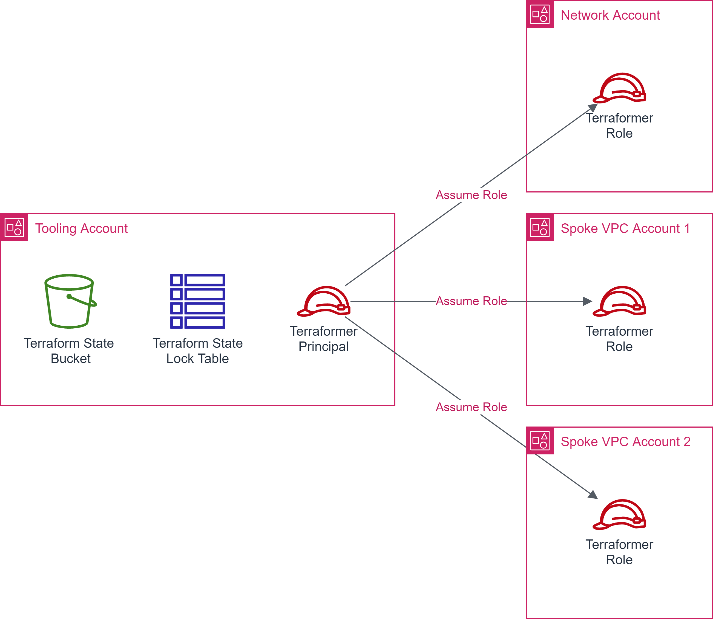

# Bootstrap Terraform backend

[Terraform Backends](https://www.terraform.io/language/settings/backends) defines where Terraform's state snapshots are stored. [Amazon S3 Backend](https://www.terraform.io/language/settings/backends/s3) stores the Terraform state as a given key in a given bucket on Amazon S3. This backend also supports state locking and consistency checking via Dynamo DB.

In a multi-account environment using AWS Organizations, it is a best practice to have a `tooling` account where Terraform backend resources are created.
The `Terraformer` principal in the `tooling` account should be able to assume a `Terraformer` role with appropriate permissions to create the resources in the other account(s).

This is an example Terraform bootstrap script, which bootstraps the Terraform Backend as well as provisions the delegated access to multiple-accounts.

<p align="center"></p>

## Prerequisites

- Modify `terraform.tfvars`. Make sure to provide desired values for:
  - `region` --> Target AWS Region
  - `s3_statebucket_name` --> Globally unique Amazon S3 bucket name
  - `dynamo_locktable_name` --> DynamoDB table name used for state locking
- Modify `provider.tf`.
  - Comment out the `backend` section.
    ```text
      # backend "s3" {
      #   ...
      # }
    ```
  - Verify/modify `provider` as needed.
    ```text
    provider "aws" {
      region  = var.region
      profile = "tooling-admin"
      alias   = "tooling"
    }
    ...
    ```
  - Make sure that all the `profile` specified in all the `provider` sections exists in `.aws/config` file. e.g.
    ```text
    [profile tooling-admin]
    aws_access_key_id=<your-access-key-id>
    aws_secret_access_key=<your-secret-access-key>
    region=us-east-1
    output=json

    [profile nw-admin]
    aws_access_key_id=<your-access-key-id>
    aws_secret_access_key=<your-secret-access-key>
    region=us-east-1
    output=json

    [profile sec-admin]
    aws_access_key_id=<your-access-key-id>
    aws_secret_access_key=<your-secret-access-key>
    region=us-east-1
    output=json

    [profile dev-admin]
    aws_access_key_id=<your-access-key-id>
    aws_secret_access_key=<your-secret-access-key>
    region=us-east-1
    output=json

    [profile test-admin]
    aws_access_key_id=<your-access-key-id>
    aws_secret_access_key=<your-secret-access-key>
    region=us-east-1
    output=json
    ```
- Modify `outputs.tf`.
  - Make sure to output all the `role_arn` created for delegated access.

## Execution

- cd to `examples/bootstrap` folder.
- Make sure you are using the correct AWS Profile that has permission to provision the target resources. e.g. "tooling-admin"
    - `aws sts get-caller-identity`
- Execute `terraform init` to initialize Terraform.
- Execute `terraform plan` and verify the changes.
- Execute `terraform apply` and approve the changes.
- Switch to using Amazon S3 backend by un-commenting the `backend "S3"` section within `provider.tf`
  - Modify `backend "S3"` section with correct values for `region`, `bucket`, `dynamodb_table`, and `key`. Use provided values as guidance.
- Execute `terraform init` to re-initialize Terraform with new backend.
  - This will ask you to move your state to Amazon S3. Enter 'yes'.
- Once you have your Terraform state on Amazon S3, you can continue to make updates to bootstrap as needed, using the Amazon S3 as backend.

<!-- BEGIN_TF_DOCS -->
## Requirements

| Name | Version |
|------|---------|
| <a name="requirement_terraform"></a> [terraform](#requirement\_terraform) | >= v1.3.9 |
| <a name="requirement_aws"></a> [aws](#requirement\_aws) | >= 4.56.0 |

## Providers

No providers.

## Modules

| Name | Source | Version |
|------|--------|---------|
| <a name="module_bootstrap"></a> [bootstrap](#module\_bootstrap) | ../../modules/aws/bootstrap | n/a |
| <a name="module_bootstrap_dev_account_access"></a> [bootstrap\_dev\_account\_access](#module\_bootstrap\_dev\_account\_access) | ../../modules/aws/bootstrap | n/a |
| <a name="module_bootstrap_network_account_access"></a> [bootstrap\_network\_account\_access](#module\_bootstrap\_network\_account\_access) | ../../modules/aws/bootstrap | n/a |
| <a name="module_bootstrap_sec_account_access"></a> [bootstrap\_sec\_account\_access](#module\_bootstrap\_sec\_account\_access) | ../../modules/aws/bootstrap | n/a |
| <a name="module_bootstrap_test_account_access"></a> [bootstrap\_test\_account\_access](#module\_bootstrap\_test\_account\_access) | ../../modules/aws/bootstrap | n/a |

## Resources

No resources.

## Inputs

| Name | Description | Type | Default | Required |
|------|-------------|------|---------|:--------:|
| <a name="input_region"></a> [region](#input\_region) | The AWS Region e.g. us-east-1 for the environment | `string` | n/a | yes |
| <a name="input_s3_statebucket_name"></a> [s3\_statebucket\_name](#input\_s3\_statebucket\_name) | Globally unique name of the S3 bucket used for storing Terraform state files. | `string` | n/a | yes |
| <a name="input_tags"></a> [tags](#input\_tags) | Mandatory tags for the resources | `map(string)` | n/a | yes |
| <a name="input_dynamo_locktable_name"></a> [dynamo\_locktable\_name](#input\_dynamo\_locktable\_name) | Name of the DynamoDB table used for Terraform state locking. | `string` | `""` | no |

## Outputs

| Name | Description |
|------|-------------|
| <a name="output_backend_config"></a> [backend\_config](#output\_backend\_config) | Define the backend configuration with following values |
| <a name="output_dev_account_role_arn"></a> [dev\_account\_role\_arn](#output\_dev\_account\_role\_arn) | Delegated Role ARN for dev account |
| <a name="output_network_account_role_arn"></a> [network\_account\_role\_arn](#output\_network\_account\_role\_arn) | Delegated Role ARN for network account |
| <a name="output_sec_account_role_arn"></a> [sec\_account\_role\_arn](#output\_sec\_account\_role\_arn) | Delegated Role ARN for sec account |
| <a name="output_test_account_role_arn"></a> [test\_account\_role\_arn](#output\_test\_account\_role\_arn) | Delegated Role ARN for test account |
<!-- END_TF_DOCS -->
